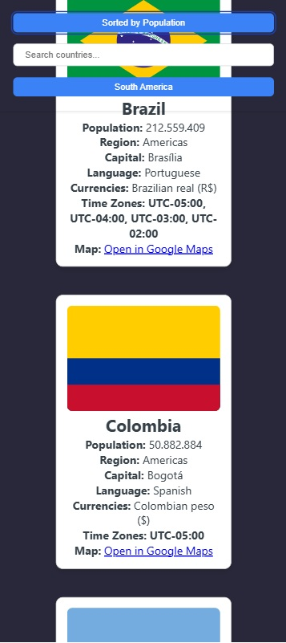

# REST API countries app

This is a React application created with Vite. It takes informations about countries from https://restcountries.com API and displays them in the app. We can filter countries based on what we chose from header bar. We can search for countries, we can filter them by continents and by populations when all countries are chosen or specific region (continent) is applied. There is also a google maps link besides each country that opens a new tab and directs us to googleMaps. Principles of responsive design where taken into account so that the app can be used either with computers, phones or smart pads. 

Docker image
https://hub.docker.com/r/bezovsekjan/restapicountries/tags

----

----

----

----

----

